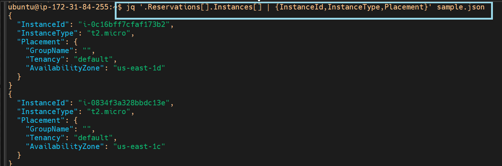

## Shell Scripting.

**Outcomes of script present under AWS-Resources-folder**
 
  - **Outcome of script List_aws-resource.sh**
    --- 
    - 

    - 

    - 
    ---

- **Outcome of script Using_case_list_aws_resources.sh**
    --- 
    - 

    - 
    
    - 
    ---

**Outcomes of jq queries using sample json and some basic commands**
  ---
  - 
  - 
  - 
  - 
  - 
  - 
  - 
  ---

** **Outcomes of Cost-optimization script present**